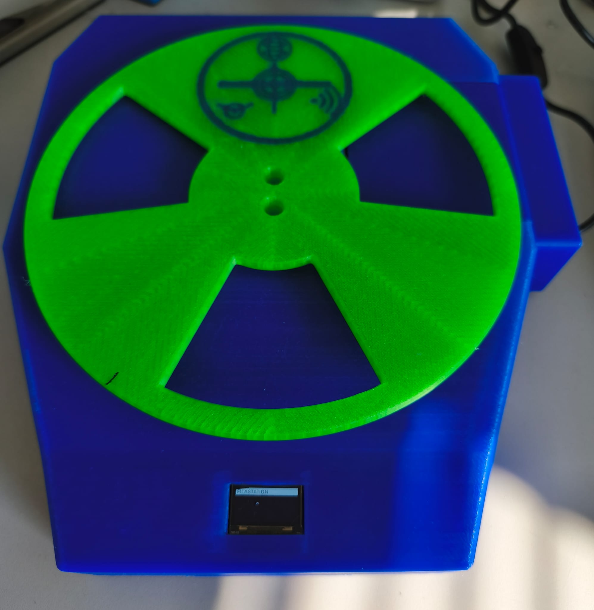

# FilaStation v2.13

**Professionelles Filament-Management für den Creality K2 Plus CFS**

Raspberry Pi-basiertes System zur Verwaltung von Filamentspulen mit NFC-Tagging, Gewichtsmessung, Druckkostenkalkulation und vollständigem Auftragsmanagement inkl. Angebots- und Rechnungsgenerierung.

> 💡 Inspiriert von [FilaMan](https://github.com/ManuelWeiser/FilaMan) von Manuel Weiser (MIT License) — vielen Dank!

---



---

## Features

- **Spulenverwaltung** — Übersicht mit Füllstand, Lagerort, Temperaturen, Hersteller, Bestellnummer
- **NFC-Tags schreiben** — Creality CFS-kompatible verschlüsselte Tags, direkt vom K2 Plus erkannt
- **Waage & automatische Erkennung** — HX711 Load Cell liest Gewicht und NFC gleichzeitig
- **Auftragsmanagement** — Von der Anfrage bis zur Rechnung: .3mf Import, Kalkulation, PDF-Export
- **Angebot & Rechnung** — Automatischer PDF-Wechsel je nach Auftragsstatus, mit Firmendaten
- **Lernfunktion** — Korrekturfaktoren aus abgeschlossenen Drucken für genauere Kalkulationen
- **Master-Steuerung** — TARE, Kalibrierung, Neustart und Shutdown der Waage per Web-UI
- **OLED Boot-Anzeige** — Statusanzeige auf dem Display beim Hochfahren
- **Mehrfarben-Kalkulation** — Jeder CFS-Slot wird separat mit Gewicht und Preis kalkuliert

---

## Hardware

| Komponente | Details |
|---|---|
| **Pi 4 (Server)** | Raspberry Pi 4 (2–4 GB RAM), Flask-Server, SQLite |
| **Pi 3 (Waage)** | Raspberry Pi 3, HX711, PN532 NFC HAT, SSD1306 OLED |
| **Waagenzelle** | HX711 Load Cell — GPIO23 (DATA), GPIO24 (CLK) |
| **NFC** | Waveshare PN532 HAT — UART `/dev/ttyS0` (Jumper I0=L, I1=L) |
| **OLED** | SSD1306 128×64, I2C Bus 1 (GPIO2/3), luma.oled |
| **Drucker** | Creality K2 Plus CFS — Klipper + Moonraker API |

Die 3D-Druckdateien (STL + 3MF) für das Gehäuse sind auf Printables.com verfügbar:

**[➡️ FilaStation auf Printables.com](https://www.printables.com/model/1660320-filastation-filament-management-system-for-crealit)**

---

## Software-Architektur

```
┌─────────────────────────────┐     ┌──────────────────────────────┐
│  Pi 4 — FilaStation Server  │     │   Pi 3 — Waage & NFC         │
│  server_v2_13.py (Flask)    │◄────│   waage_v2_12.py             │
│  SQLite: filament.db        │     │   HX711 + PN532 + OLED       │
│  Port 5000                  │     │   polling alle 2 Sek         │
└─────────────────────────────┘     └──────────────────────────────┘
          │                                      │
          ▼                                      ▼
   Browser Web-UI                    Creality K2 Plus CFS
   (beliebiges Gerät)                NFC-Tags + Moonraker API
```

---

## Installation

### Voraussetzungen

- Raspberry Pi 4 mit Raspberry Pi OS (64-bit)
- Raspberry Pi 3 mit GPIO
- Python 3.9+
- [Waveshare PN532 Library](https://github.com/waveshare/PN532) im Home-Verzeichnis des Pi 3

### Pi 4 — Server

```bash
pip install flask reportlab pillow --break-system-packages

# Dateien kopieren
cp server_v2_13.py ~/filamentserver/server.py

# Service starten
sudo systemctl enable filamentserver
sudo systemctl start filamentserver
```

### Pi 3 — Waage & NFC

```bash
pip install requests hx711 luma.oled pycryptodome --break-system-packages

# Waveshare PN532 Library ins Home-Verzeichnis klonen
git clone https://github.com/waveshare/PN532.git ~/pn532

# Konfiguration anlegen
cp waage_config.example.json ~/waage_config.json
# → waage_config.json bearbeiten: server_url auf IP des Pi 4 setzen

# Waage-Script kopieren
cp waage_v2_12.py ~/waage.py

# Service starten
sudo systemctl enable waage
sudo systemctl start waage
```

### Konfiguration

Die Datei `waage_config.json` (aus `waage_config.example.json` erstellen):

```json
{
  "server_url": "http://<PI4-IP>:5000",
  "master_tags": {
    "tare":      null,
    "calibrate": null,
    "shutdown":  null,
    "reboot":    null
  },
  "calibration": {
    "gram_factor":    416.9,
    "zero_baseline":  0.0
  },
  "registered": false
}
```

> ⚠️ Die `waage_config.json` enthält nach der Kalibrierung deine NFC-Master-Tag-UIDs und persönliche Kalibrierwerte — diese Datei **nicht** in Git einchecken (ist in `.gitignore` ausgeschlossen).

### Web-UI aufrufen

```
http://<PI4-IP>:5000
```

Netzwerk-IPs, Firmendaten und Kostenparameter direkt im Browser unter **Einstellungen** konfigurieren.

---

## Wichtige Hinweise

| Thema | Hinweis |
|---|---|
| `dtoverlay=disable-bt` | **NICHT** in `/boot/config.txt` eintragen — bricht `/dev/ttyS0` |
| PN532 Jumper | I0=L, I1=L (UART-Modus) |
| Waagenzelle | Ist invertiert montiert — das ist so gewollt, Formel im Code berücksichtigt das |
| NFC-Keys | Die Creality CFS Sektor-Keys sind aus der Creality-Firmware reverse-engineered — gleich für alle K2+ CFS Geräte |
| Browser-Cache | Nach Updates immer Ctrl+Shift+R (Hard-Reload) |

---

## Dokumentation

- 📄 **[FilaStation-Dokumentation-v2_13.docx](FilaStation-Dokumentation-v2_13.docx)** — Vollständige Funktionsdokumentation (10 Kapitel)
- 🔧 **[FilaStation-Setup-Guide.docx](FilaStation-Setup-Guide.docx)** — Schritt-für-Schritt Installationsanleitung

---

## Lizenz

MIT License — siehe [LICENSE](LICENSE)

```
Copyright (c) 2026 Andreas Heubach (HEA)
```

Dieses Projekt ist inspiriert von **FilaMan** von Manuel Weiser, ebenfalls unter MIT License.

---

## Danksagung

- [Manuel Weiser](https://github.com/ManuelWeiser/FilaMan) — FilaMan Projekt (MIT), Inspiration für FilaStation
- [Waveshare](https://www.waveshare.com) — PN532 NFC HAT und Library
- [tatobari](https://github.com/tatobari/hx711py) — HX711 Python Library
- [luma.oled](https://github.com/rm-hull/luma.oled) — OLED Display Library

---

*FilaStation — Open-Source Filament-Management von Andreas Heubach (HEA) · © HEA 2026*
